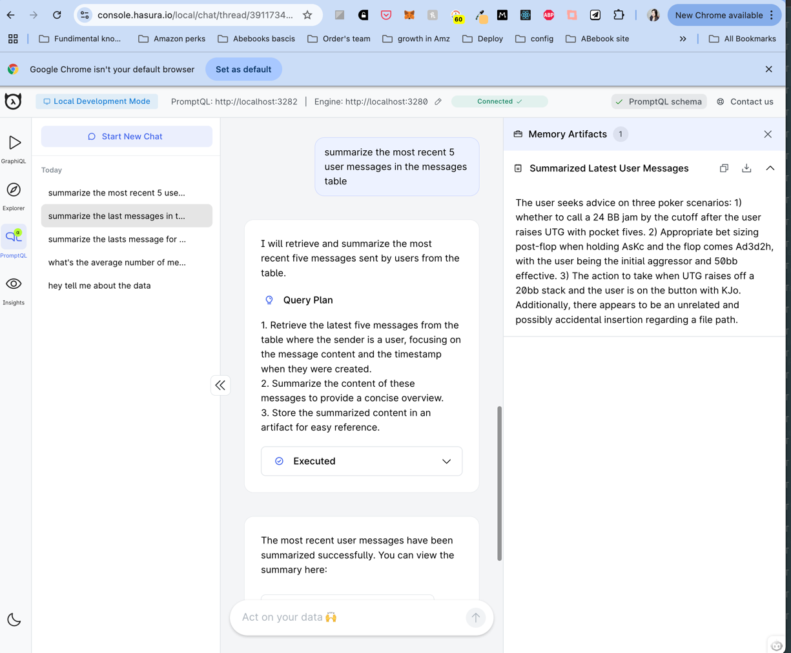

# Feedback Assistant

This feedback assistant enables engineers to interact directly with the messages table in Supabase, which logs error messages presented to end users.

## Set up Instruction
1. Copy the example `.env` file to create your own:
   ```bash
   cp .env.example .env

2.  Configure your `.env` file with your **Anthropic (or OpenAI) API key** and your **Database Uri**.

   ```bash
   OPENAI_API_KEY=
   APP_MY_PG_CONNECTION_URI=
   ```
   
3.  Start the assistant
   ```bash
    ddn run docker-start
   ```
4. From the project directory, run:
   ```bash
   ddn console --local
   ```
This should open up your browser (or print a browser URL) for opening up your console. It’ll typically be something like: https://console.hasura.io/local?engine=localhost:3280&promptql=localhost:3282.

The console is a client-side web app hosted at console.hasura.io and it connects to your local PromptQL API and data sources. Your data is not sent or saved anywhere else.

Head over to the console and say hi to your AI!
   ```bash
   > Hi!
   ```


Demo image:

